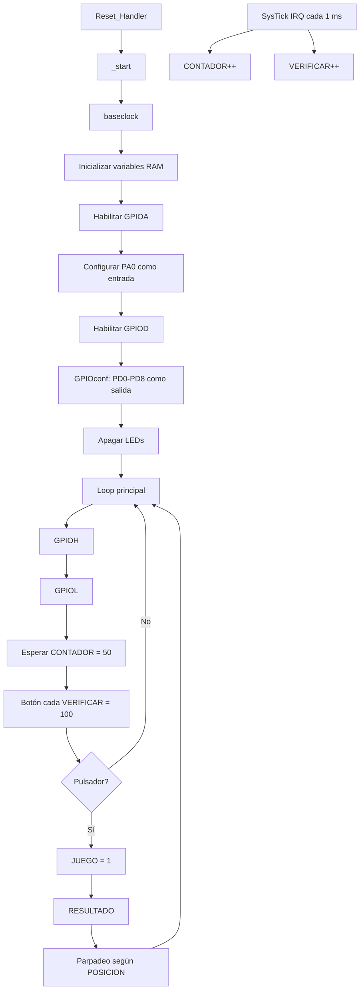

# RETO 1 — Juego de LEDs en ARM Thumb-2 Bare-Metal

## 1. Descripción

Este repositorio implementa un sistema de barrido secuencial de LEDs y detección de pulsación usando **ensamblador ARM Thumb-2** sobre un **STM32F407VE / Cortex-M4**.

La aplicación utiliza acceso directo a registros de memoria (*memory-mapped registers*) para:

- habilitar los relojes de GPIO;
- configurar PA0 como entrada;
- configurar PD0–PD8 como salidas;
- controlar el estado de los LEDs usando `ODR`;
- leer el pulsador usando `IDR`;
- generar una base de tiempo con **SysTick**;
- mantener contadores de tiempo en RAM;
- congelar la posición cuando se detecta la pulsación;
- generar un parpadeo de resultado.

> **Importante:** esta documentación describe el comportamiento real del código entregado. También identifica expresamente las diferencias entre la implementación actual y algunos criterios ideales de la rúbrica, para evitar afirmaciones incorrectas durante la sustentación.

---

## 2. Hardware y plataforma

| Elemento | Configuración |
|---|---|
| MCU | STM32F407VE |
| CPU | ARM Cortex-M4 |
| ISA | ARMv7E-M |
| Estado del código | Thumb-2 |
| IDE/proyecto | SEGGER Embedded Studio |
| Interfaz de depuración | J-Link / SWD |
| Botón | PA0 |
| LEDs | Banco conectado a GPIO D; el código configura PD0–PD8 |
| Temporizador | SysTick |
| Base temporal | 1 ms por interrupción |
| RAM usada por variables | 0x20000000 en adelante |
| Stack | 0x2001F800–0x2001FFFF |

El proyecto está configurado con `__NO_SYSTEM_INIT`, por lo que no se utiliza una rutina `SystemInit()` externa para configurar el reloj del sistema. En el arranque del STM32F407 se utiliza el reloj por defecto disponible en el dispositivo; para los cálculos de SysTick de esta implementación se toma **16 MHz**.

---

## 3. Estructura del repositorio

```text
RETO_1_GITHUB/
│
├── README.md
│
├── src/
│   ├── start.s
│   ├── baseclock.s
│   ├── GPIOconf.s
│   └── GPIOset.s
│
├── docs/
│   ├── 01_ARQUITECTURA.md
│   ├── 02_REGISTROS_OFFSETS.md
│   ├── 03_SYSTICK_Y_TIEMPOS.md
│   ├── 04_GPIO_HARDWARE.md
│   ├── 05_FLUJO_LOGICO.md
│   ├── 06_MEMORIA_Y_MAP.md
│   ├── 07_SUSTENTACION_QA.md
│   ├── 08_AUDITORIA_RUBRICA.md
│   ├── 09_INSTRUCCIONES_CLAVE.md
│   └── 10_PREGUNTAS_CLAVE.md
│
└── project/
    └── RETO_1/
        ├── RETO_1.emProject
        ├── *.s
        ├── STM32F4xx/
        ├── CMSIS_5/
        └── Output/
```

### Sobre `src/GPIOset.s`

`GPIOset.s` existe en el material original, pero **no forma parte del build** indicado por `RETO_1.emProject` y su contenido está incompleto. No debe presentarse como parte funcional de la aplicación. Se conserva únicamente para trazabilidad del proyecto original.

La implementación enlazada utiliza:

- `start.s`
- `baseclock.s`
- `GPIOconf.s`
- `stm32f407xx_Vectors.s`
- `STM32F4xx_Startup.s`

---

## 4. Arquitectura del software



La aplicación está separada en módulos para evitar que `_start` concentre toda la lógica:

- `baseclock.s`: configuración de SysTick.
- `GPIOconf.s`: construcción de la máscara de `GPIOD_MODER`.
- `start.s`: inicialización, máquina de estados principal, lectura del botón, barrido y resultado.
- `GPIOset.s`: archivo original no utilizado en el enlace.

---

## 5. Variables de estado en RAM

La aplicación reserva manualmente cuatro palabras de 32 bits:

| Variable | Dirección | Función |
|---|---:|---|
| `CONTADOR` | `0x20000000` | Base temporal para el barrido y parpadeo |
| `VERIFICAR` | `0x20000004` | Base temporal para muestreo del botón |
| `POSICION` | `0x20000008` | Guarda la posición del LED |
| `JUEGO` | `0x2000000C` | Estado: `0` = ejecución, `1` = resultado |

Estas direcciones están dentro de la SRAM del STM32F407 y quedan separadas del stack, que el mapa de enlace ubica en `0x2001F800–0x2001FFFF`.

---

## 6. Funcionamiento temporal

El valor cargado en SysTick es:

```text
SYST_RVR = 0x3E7F = 15999 decimal
```

Con:

```text
fCPU = 16 MHz
```

se obtiene:

```text
Ttick = (15999 + 1) / 16 000 000
      = 0.001 s
      = 1 ms
```

Por eso, `SysTick_Handler` se ejecuta aproximadamente cada **1 ms**.

La lógica de la aplicación utiliza:

```text
CONTADOR = 50   → 50 ms entre actualizaciones del barrido
VERIFICAR = 100 → 100 ms entre lecturas del botón
```

En `RESULTADO`:

```text
R5 = 300 → 300 ms por cambio de estado del LED
R5 = 50  → 50 ms por cambio de estado del LED
```

> El código fuente contiene comentarios que describen estos últimos valores como “5 ticks” y “10 ticks / ~1 segundo”. Esos comentarios no coinciden con el valor real de SysTick de 1 ms. La documentación usa el comportamiento matemáticamente consistente: **300 ms y 50 ms**.

---

## 7. Acceso a registros

### RCC

```text
RCC_BASE              = 0x40023800
RCC_AHB1ENR_OFFSET    = 0x30
RCC_AHB1ENR           = 0x40023830
```

Se habilitan:

```text
bit 0 → GPIOAEN
bit 3 → GPIODEN
```

Máscara:

```text
0000 0000 0000 0000 0000 0000 0000 1001
                                      ^  ^
                                      |  +-- GPIOA
                                      +----- GPIOD
```

Valor combinado:

```text
0x00000009
```

---

## 8. GPIO

### GPIOA

```text
GPIOA_BASE = 0x40020000
MODER      = 0x40020000
IDR        = 0x40020010
```

PA0 se deja como entrada usando:

```asm
BIC R3, R1, R2
```

con:

```text
R2 = 0x00000001
```

Esto limpia el bit 0 del `MODER`. Para PA0, los bits `[1:0] = 00` corresponden a entrada.

El botón se consulta con:

```asm
LDR R1, [R0, #GPIOx_IDR_OFFSET]
MOV R8, #1
ANDS R3, R1, R8
```

La máscara `0x1` aísla exclusivamente `IDR0`.

### GPIOD

```text
GPIOD_BASE = 0x40020C00
MODER      = 0x40020C00
ODR        = 0x40020C14
```

`GPIOconf` construye:

```text
0x00015555
```

que contiene unos en:

```text
bit 0, 2, 4, 6, 8, 10, 12, 14, 16
```

Cada par de bits de `MODER` representa un pin:

```text
00 = Input
01 = General purpose output
10 = Alternate function
11 = Analog
```

Por ello, `0x15555` configura PD0–PD8 como GPIO de propósito general en modo salida.

---

## 9. Resultado del enlace

El archivo `.map` muestra:

```text
_vectors      0x08000000
baseclock     0x08000188
GPIOconf      0x080001BC
_start        0x080001EC
SysTick_Handler 0x080002B7
Reset_Handler 0x08000489
```

El código RX total reportado por el linker es de:

```text
1180 bytes
```

El stack reservado es de:

```text
2048 bytes
```

---

## 10. Puntos críticos para la sustentación

### Pregunta: ¿Es realmente bare-metal?

Sí, la lógica de aplicación accede directamente a registros usando direcciones de memoria y no utiliza HAL, LL ni funciones de abstracción para GPIO o SysTick.

### Pregunta: ¿SysTick está funcionando por polling?

No exactamente.

El **SysTick genera una interrupción periódica** y `SysTick_Handler` incrementa dos contadores en RAM. El programa principal después hace **polling sobre esos contadores**.

Por eso, la arquitectura real es:

```text
SysTick IRQ → incrementa contador → main polling del contador
```

No debe afirmarse que el programa consulta directamente `COUNTFLAG` del `SYST_CSR`.

### Pregunta: ¿Por qué `0x3E7F`?

Porque:

```text
0x3E7F = 15999
15999 + 1 = 16000 ciclos
16000 / 16 MHz = 1 ms
```

### Pregunta: ¿Por qué `ORR` para RCC?

Porque no se quiere destruir la configuración de otros bits del registro. Se lee el registro, se construye una máscara y se hace:

```text
registro_nuevo = registro_actual OR máscara
```

### Pregunta: ¿Por qué `BIC` para MODER?

Porque se necesita limpiar bits específicos sin modificar el resto del registro.

### Pregunta: ¿Qué hace `ANDS`?

Realiza una operación AND y actualiza las banderas del APSR. Se usa para extraer el bit del botón.

### Pregunta: ¿Qué hace `EOR` en RESULTADO?

Hace XOR entre el `ODR` actual y una máscara de un único LED. Si el bit estaba en 1 pasa a 0; si estaba en 0 pasa a 1. Es una operación de **toggle**.

---

## 11. Observaciones de ingeniería

La documentación distingue entre el diseño intencional y el comportamiento exacto del código.

1. `baseclock.s` configura SysTick; no modifica RCC para cambiar la frecuencia del sistema.
2. El código usa SysTick por interrupción, no usando lectura directa de `COUNTFLAG`.
3. El muestreo del botón ocurre cada 100 ms, lo cual proporciona una forma de filtrado temporal grueso, pero no implementa un algoritmo clásico de debounce por estabilidad consecutiva.
4. `GPIOconf` configura PD0–PD8, es decir, nueve pines. El proyecto se describe como banco de ocho LEDs, por lo que esta relación debe verificarse físicamente.
5. La lógica de barrido incrementa contadores y desplaza máscaras de forma independiente. El flujo exacto se documenta en `05_FLUJO_LOGICO.md`.
6. `GPIOset.s` no está incluido en el build y su implementación está incompleta.
7. Los comentarios de `RESULTADO` no coinciden con los tiempos calculados a partir de SysTick.
8. No hay que presentar el sistema como una máquina de estados formal con estados de “acierto” y “fallo” independientes: el código actual usa `JUEGO` como bandera de resultado y selecciona dos velocidades de parpadeo según `POSICION`.

---

## 12. Cómo usar la documentación

Para una revisión rápida antes de la sustentación:

1. Leer `01_ARQUITECTURA.md`.
2. Memorizar la tabla de `02_REGISTROS_OFFSETS.md`.
3. Entender completamente `03_SYSTICK_Y_TIEMPOS.md`.
4. Repasar el flujo de `05_FLUJO_LOGICO.md`.
5. Practicar las preguntas de `07_SUSTENTACION_QA.md`.
6. Revisar `09_PREGUNTAS_CLAVE` para identificar cómo se usó la IA.

---

## 13. Regla de oro para la sustentación

No memorizar únicamente los valores hexadecimales.

Para cada registro se debe poder responder:

```text
1. ¿Qué periférico controla?
2. ¿Cuál es su dirección base?
3. ¿Cuál es el offset?
4. ¿Qué dirección efectiva resulta?
5. ¿Qué bits se modifican?
6. ¿Por qué se usa ORR/BIC/AND/EOR?
7. ¿Qué efecto físico produce?
```

Ese razonamiento sirve para defender el código incluso si se solicita modificar una máscara o rastrear una ejecución en vivo.
