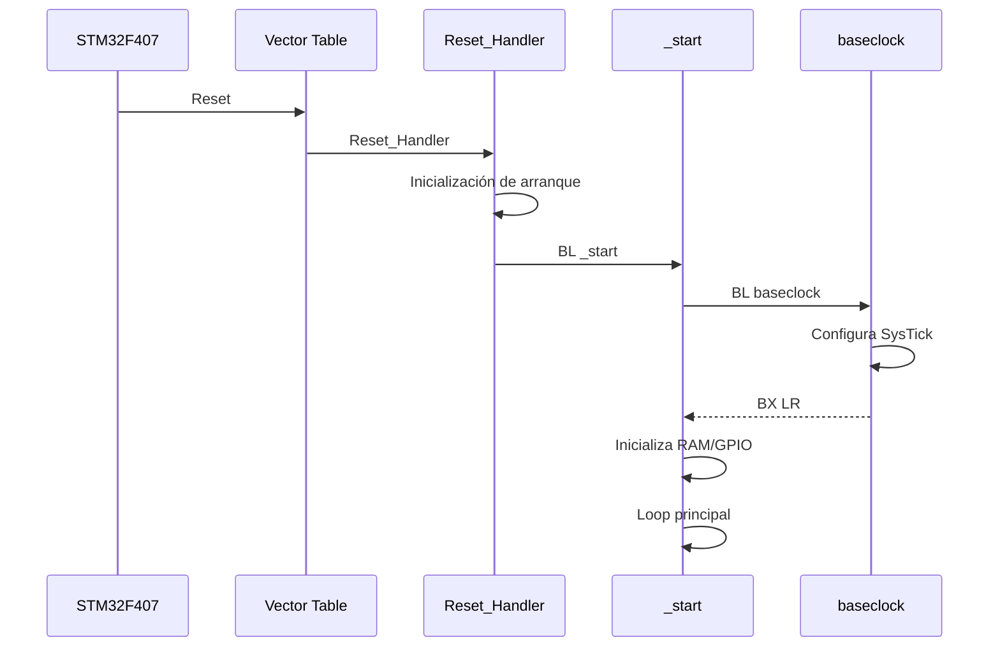

# 01 — Arquitectura del software

## 1. Propósito

El programa implementa un juego temporal con un banco de LEDs:

1. Inicializa SysTick.
2. Inicializa variables de estado.
3. Habilita GPIOA y GPIOD.
4. Configura PA0 como entrada.
5. Configura PD0–PD8 como salidas.
6. Apaga los LEDs.
7. Ejecuta el barrido.
8. Muestrea el botón.
9. Al detectar pulsación, congela la ejecución normal usando `JUEGO = 1`.
10. Ejecuta el modo `RESULTADO`.

La implementación está dividida en módulos de ensamblador.

## 2. Módulos

| Archivo | Responsabilidad | Enlace |
|---|---|---|
| `start.s` | Entrada `_start`, GPIO, barrido, botón, resultado y `SysTick_Handler` | Sí |
| `baseclock.s` | Configuración de SysTick | Sí |
| `GPIOconf.s` | Construcción de máscara para `GPIOD_MODER` | Sí |
| `GPIOset.s` | Código original incompleto | No |
| `stm32f407xx_Vectors.s` | Tabla de vectores y handlers débiles | Sí |
| `STM32F4xx_Startup.s` | Reset y arranque | Sí |

## 3. Cadena de arranque



## 4. Registro de retorno

Las funciones se llaman con `BL`, por lo que `LR` recibe la dirección de retorno.

Ejemplo:

```asm
BL baseclock
```

`baseclock` termina con:

```asm
BX LR
```

La misma estructura se usa para `GPIOconf`, `GPIOH`, `GPIOL` y `Botón`.

## 5. Convención práctica de registros

No existe ABI de C involucrada en la lógica principal; los registros se usan como variables de trabajo:

| Registro | Uso observado |
|---|---|
| R0 | Dirección base o puntero |
| R1 | Valor leído/escrito |
| R2 | Máscara de LED / máscara temporal |
| R3 | Resultado de operación lógica |
| R4 | Máscara del LED anterior |
| R5 | Umbral temporal |
| R6 | Máscara construida por `GPIOconf` |
| R7 | Posición del barrido |
| R8 | Máscara del botón / máscara de toggle |

La interpretación es contextual: un mismo registro puede asumir otra función en otra rutina.

## 6. Máquina de estados real

El código tiene dos estados principales representados por `JUEGO`:

```text
JUEGO = 0 → ejecución normal
JUEGO = 1 → resultado
```

No existe una variable separada para “acierto” y otra para “fallo”. La posición se utiliza para seleccionar la velocidad del parpadeo.

## 7. Principio de diseño

La separación modular sirve para que `_start` sea el coordinador del sistema mientras las rutinas realizan tareas específicas.

El programa evita:

- HAL;
- LL;
- `delay()` de biblioteca;
- GPIO usando API de alto nivel;
- temporizadores de software basados en NOP.

El tiempo se deriva de SysTick.
