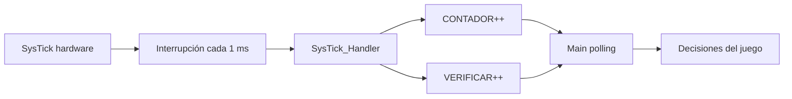

# 03 — SysTick y cálculo temporal

## 1. Objetivo

SysTick proporciona una interrupción periódica utilizada como base de tiempo.

La rutina `SysTick_Handler` no ejecuta la lógica del juego directamente. Solo incrementa:

```text
CONTADOR
VERIFICAR
```

Esto separa la generación del tiempo de las decisiones del programa principal.

---

## 2. Registros utilizados

```text
SYST_CSR = 0xE000E010
SYST_RVR = 0xE000E014
SYST_CVR = 0xE000E018
```

Configuración:

```text
RVR = 0x3E7F
CSR = 0x07
CVR = 0
```

---

## 3. Cálculo del período

El Cortex-M4 utiliza una fuente de reloj de 16 MHz para este cálculo.

Frecuencia:

```text
f = 16 000 000 Hz
```

Período de un ciclo:

```text
Tclk = 1/f
     = 1 / 16 000 000
     = 62.5 ns
```

SysTick cuenta:

```text
RVR + 1
```

ciclos.

Como:

```text
RVR = 0x3E7F
    = 15999
```

entonces:

```text
N = 15999 + 1
  = 16000 ciclos
```

Tiempo:

```text
Ttick = 16000 × 62.5 ns
      = 1 000 000 ns
      = 1 ms
```

Frecuencia de interrupción:

```text
fsystick = 1 / 0.001
         = 1000 Hz
```

---

## 4. Rutina de interrupción

```asm
SysTick_Handler:

    LDR R0, =CONTADOR
    LDR R1, [R0]
    ADD R1, R1, #1
    STR R1, [R0]

    LDR R0, =VERIFICAR
    LDR R1, [R0]
    ADD R1, R1, #1
    STR R1, [R0]

    BX LR
```

Cada interrupción produce:

```text
CONTADOR ← CONTADOR + 1
VERIFICAR ← VERIFICAR + 1
```

Por eso, ambos valores representan milisegundos acumulados mientras no sean reiniciados.

---

## 5. Barrido de LEDs

En el loop:

```asm
MOV R5, #50
CMP R1, R5
BNE tiempo
```

Por eso:

```text
50 ticks × 1 ms/tick
= 50 ms
```

La actualización temporal del barrido ocurre cada aproximadamente 50 ms.

Frecuencia equivalente:

```text
1 / 0.05 = 20 Hz
```

---

## 6. Muestreo del botón

El código espera:

```text
VERIFICAR = 100
```

Entonces:

```text
100 × 1 ms = 100 ms
```

El botón se consulta cada aproximadamente 100 ms.

Esto produce un filtrado temporal grueso: rebotes muy rápidos pueden no generar una lectura independiente.

### Advertencia

No debe describirse como un debounce clásico de software basado en múltiples muestras consecutivas. La implementación actual es **muestreo periódico de 100 ms**.

---

## 7. Resultado

En `RESULTADO`:

```asm
MOV R5, #300
```

o:

```asm
MOV R5, #50
```

Por eso:

```text
300 ticks = 300 ms
50 ticks  = 50 ms
```

La selección se realiza usando:

```text
POSICION = 4 o 5 → 50 ms
otra posición    → 300 ms
```

Según el código real, `50` es el parpadeo más rápido y `300` el más lento.

---

## 8. Inconsistencia detectada

Los comentarios originales indican:

```text
"parpadeo RÁPIDO: cada 5 ticks"
"parpadeo LENTO: cada 10 ticks (~1 segundo si tick=100ms)"
```

Pero el programa carga:

```text
300
50
```

y SysTick está configurado a 1 ms.

Por ello, matematicamente:

```text
300 → 300 ms
50  → 50 ms
```

La documentación y la sustentación deben utilizar los valores reales del código, no los comentarios antiguos.

---

## 9. ¿Polling o interrupción?

La arquitectura exacta es híbrida:



Por eso:

- **generación de tick:** interrupción;
- **uso de tiempo:** polling sobre variables en RAM;
- **COUNTFLAG:** no se consulta directamente.

Esto debe explicarse así si el docente pregunta específicamente por "polling".
