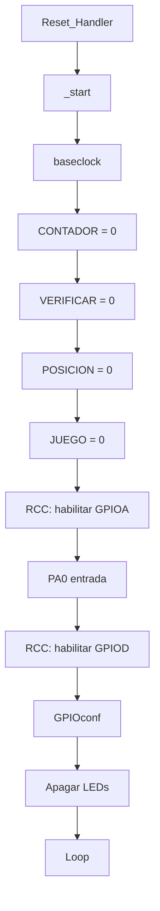
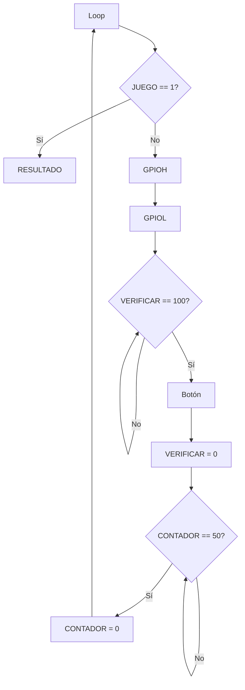
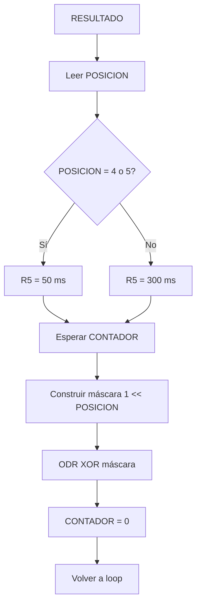

# 05 — Flujo lógico del programa

## 1. Inicialización



## 2. Loop normal



## 3. Lectura del botón

La rutina:

1. Lee `GPIOA_IDR`.
2. Aplica máscara `0x1`.
3. Reinicia `VERIFICAR`.
4. Reinicia `CONTADOR`.
5. Comprueba el resultado.
6. Si no está activo, vuelve al loop.
7. Si está activo, escribe `JUEGO = 1`.

Código conceptual:

```text
lectura = IDR & 0x1

si lectura != 1:
    continuar juego

si lectura == 1:
    JUEGO = 1
```

## 4. Resultado



## 5. Posición

`POSICION` recibe el valor de `R7` desde `GPIOL`:

```asm
ADD R7, R7, #1
...
STR R7, [R0]
```

El valor se utiliza posteriormente en `RESULTADO`.

## 6. Reinicio del barrido

Cuando:

```text
R7 == 9
```

se entra en `reinicio`.

Se ejecuta:

```text
R2 = 1
R4 = 1
R7 = 0
POSICION = 0
```

y se limpia la salida que corresponde.

---

## 7. Importante: qué significa "acierto/fallo" realmente

El código actual no implementa dos rutinas separadas llamadas `ACIERTO` y `FALLO`.

La lógica es:

```text
Botón → JUEGO = 1 → RESULTADO
```

y:

```text
POSICION 4/5 → un período
otras posiciones → otro período
```

Por eso, durante la sustentación se debe describir como una **clasificación del resultado usando la posicion**, no como dos estados independientes explícitamente implementados.

---

## 8. Debounce real

El botón se consulta cada 100 ms.

Eso significa que un rebote de algunos milisegundos normalmente queda fuera de la ventana de muestreo. Aunque, no existe:

```text
muestra 1
muestra 2
muestra 3
comparación de estabilidad
```

Por ello es más exacto llamarlo:

> muestreo periódico de baja frecuencia usado como filtro temporal del pulsador.

Si la rúbrica exige "debouncing efectivo", esta decisión debe explicarse con honestidad.
